# Incident Management Teams Provisioning

## Introduction
Organizations of all types need to respond to events and incidents, planned and unplanned. Responding in a standard and timely manner helps organizations achieve better outcomes and communicationss status to stakeholders. 

Planning for events includes templated documents, communication processes, reporting dashboards and task management. Today organizations may have all those documents and tools in separate portals and platforms. Microsoft Teams is a central hub for collaboration and brings together all these documents and sites and documents into one work area. 

With the Microsoft Graph an event-specific Teams space is quickly provisioned by , adding appsapps added, and populating templated documents populated from SharePoint libraries, insuring the event or incident is structureds for execution and retention after it’s complete. 

This project demonstrates how to provision Microsoft Teams with pre-configured channels, naming convention, templated documents, tab apps using Graph APIs, where all of the content management is configured in SharePoint lists. This project works across all types of Office 365 tenants, including [Office 365 US Government Community (GCC)](https://docs.microsoft.com/en-us/office365/servicedescriptions/office-365-platform-service-description/office-365-us-government/gcc).

The demo project has two pieces that can be replaced easily to fit with your business requirements:
- To get the group IDs for creating the Teams team, the project uses the national weather alert API as a trigger. If you want to replace the logic, implement the interface ITrigger and replace your implementation inside the Factory class.
- The demo code extracts Teams team structure data from SharePoint lists and the document library. If you have the data hosted somewhere else, implement the interface ITeamsStructureExtractor and replace your implementation inside the Factory class.

This project uses a SharePoint site as the console and host for configuring how future sites and Teams get created, referred to as the “Teams Structure Configuration Site”. As part of setting up this Incident Management provisioning system, you’ll first set up the up the Teams Structure Configuration Site.

To continue, please make sure you are an administrator and have an admin username and password for the Microsoft 365 tenant you want to deploy to.
## Configure the Teams Structure Configuration Site in SharePoint
The incident management provisioning system uses a set of SharePoint lists to determine how to provision Teams incident management sites.  The following lists are used:
- Teams channel data as SharePoint List
- Teams channel’s tab data as SharePoint List
- Teams channel’s documents data as SharePoint document library

This means that customizing and configuring how the Incident Management provisioning system works for your organization is as simple as editing a set of SharePoint lists in a web browser
### Create the SharePoint groups site for hosting team structure configuration data
The Microsoft Teams templates will be accessed and stored in Microsoft SharePoint. Please record the group ID under which your Teams Structure Configuration Site is created.  You will need this group ID to configure it inside the code configure file to read the data.
1.	Login into [Office portal](https://portal.office.com/) with an administrator account username and password, and then select SharePoint

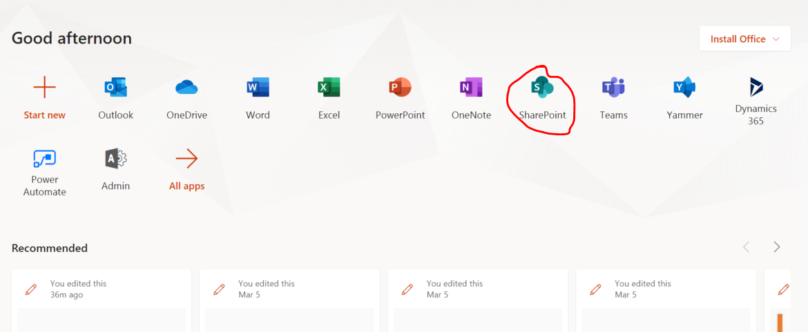

2.	Create the team site for hosting Teams structure content, you can also host the content inside any existed group site in this tenant.

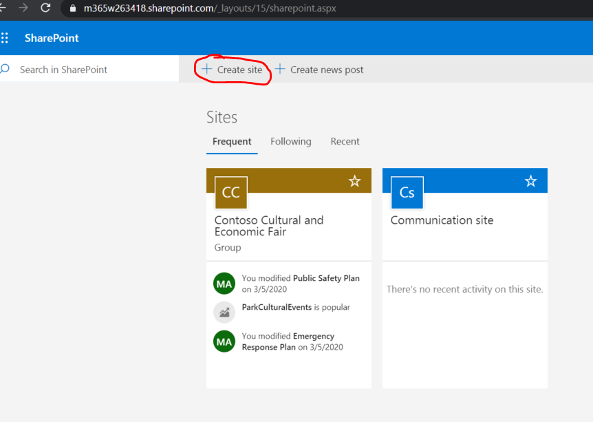

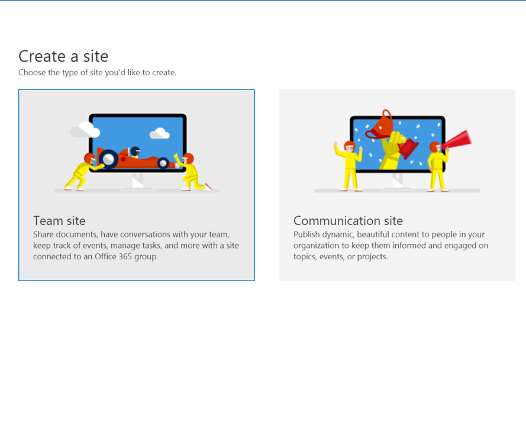

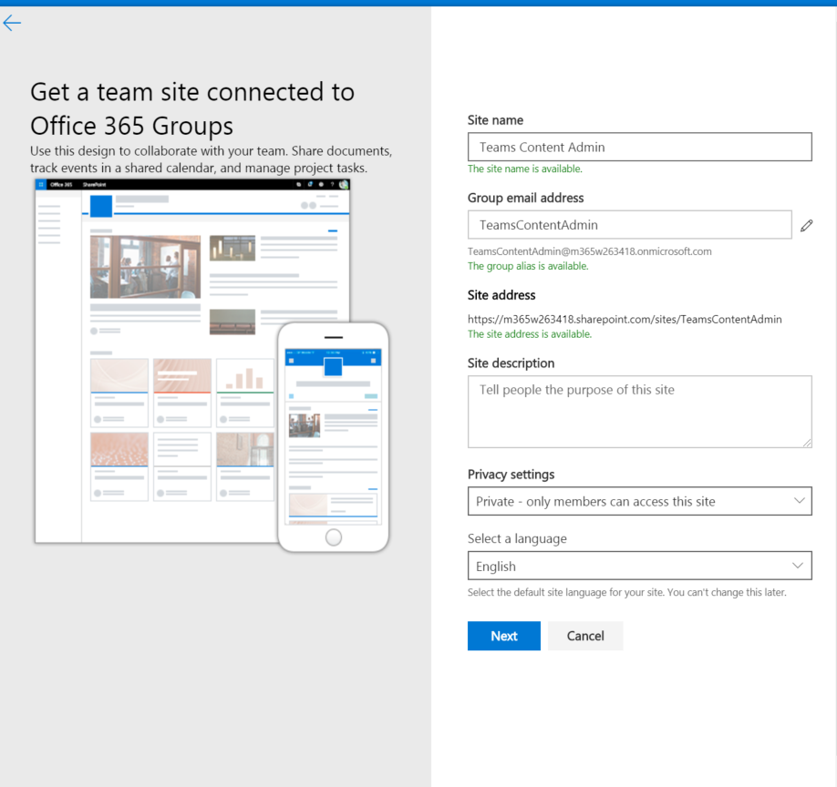

3.	Please record the group id where we host the Teams structure data for config file.  For how to find this groud ID, please refer to [this section](#how-to-find-the-group-id-for-a-o365-group).
4.	All content you create can be found on the page titled “Site Contents.”

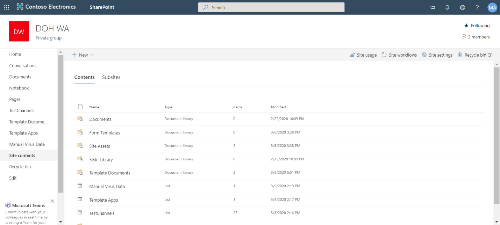

### Create Channels Data
To specify those channels you wish to create inside an incident response Microsoft Teams team, Teams channel data should be created in SharePoint as a list. Channel names given in the SharePoint list will then appear as the Teams channel names in the Microsoft Teams application. Record the list name and column name which stores the Channel name values- you will need to configure them inside the code. For how to get the column name (Not the name displayed inside SharePoint UI), please refer to [this section](#how-to-find-the-sharepoint-list-column-name).

Teams Channels Template List in SharePoint: 

 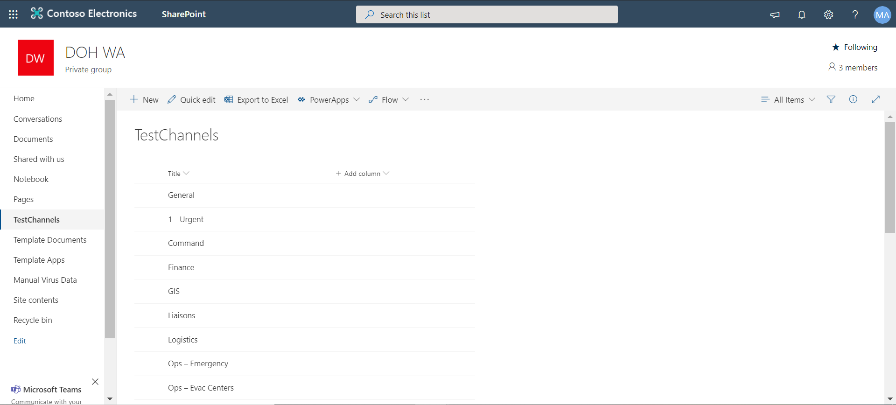

Teams Channels in Microsoft Teams:

 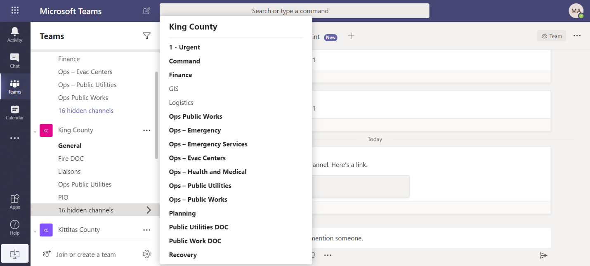

### Create Channels Tab Data
To specify tab apps to be added in the Microsoft Teams channels, the channel tab data should be created in SharePoint as a list. User must add a Lookup column to connect the data inside [this Channels Data List](#create-channels-data) to match the channel name (Please refer to [this section](#how-to-add-the-lookup-column-in-sharepoint) for Lookup column). In addition, each list item needs to have the appropriate column required by Teams tab (Teams app name, App ID, Entity ID, Content URL, Website URL, Remove URL). Please record this list name and the column names, you will need to configure them inside the code. For how to get the column names, please refer to [this section](#how-to-find-the-sharepoint-list-column-name).

If this tab is a web page, then “Entity ID” and “Remove URL” are not required, the “Content URL” and “Website URL” value should be the web page url, and the “App ID” should be “com.microsoft.teamspace.tab.web”.

In the SharePoint template example below, we selected the Teams channel “GIS” that will host the application “CDC GIS Map”. The tab will then appear in Microsoft Teams in the designated channel (GIS) with the given app name (CDC GIS Map). 

Template Apps List in SharePoint: 

 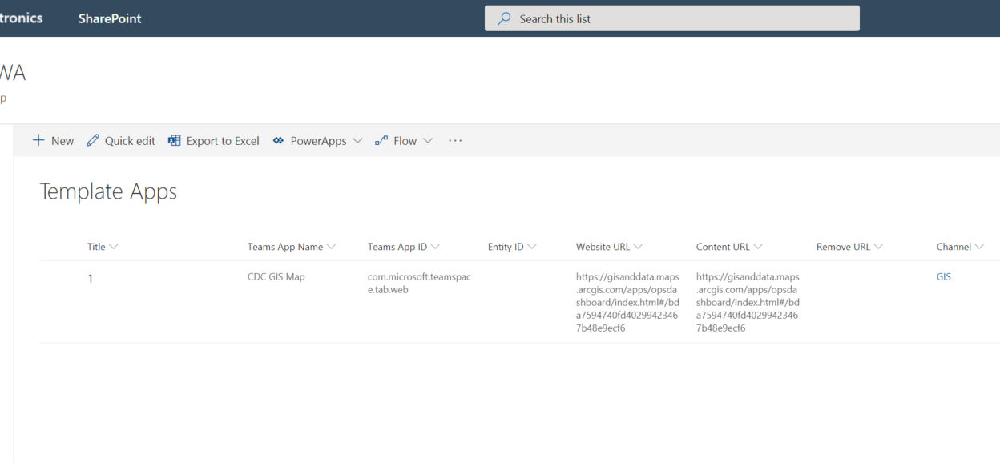

Application in Microsoft Teams Channel: 

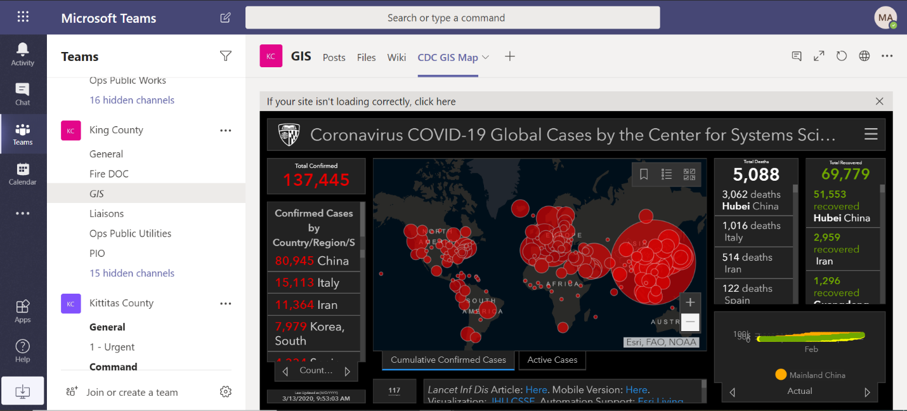

### Create the Channels Documents Data
To specify the documents to be added to the Teams channels, the channel document data needs to be created in SharePoint as a document library. User must add a Lookup column to connect the data inside [this Channels Data List](#create-channels-data) to match the channel name (Please refer to [this section](#how-to-add-the-lookup-column-in-sharepoint) for Lookup column). In the example below, we uploaded “FEMA Template-1.docx” to the Template Documents library and selected the Teams Channel named “Logistics”. The document will then appear in Microsoft Teams in the designated channel (Logistics) under the Files tab. 
Template Documents Library in SharePoint:

 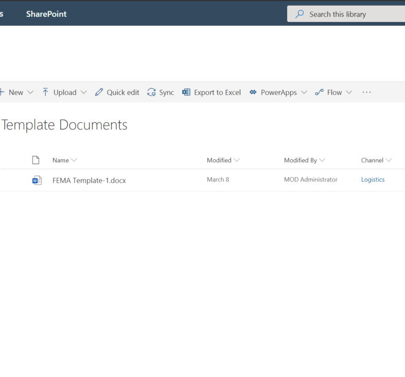

Document in Microsoft Teams Channel:

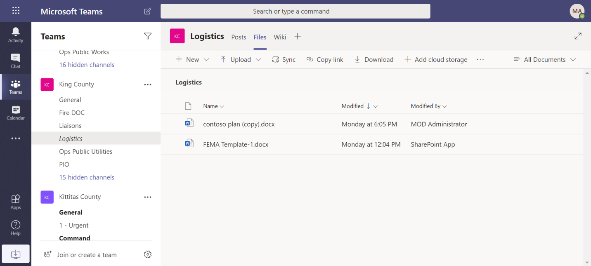

## Register application in Azure Active Directory
This code needs Microsoft Graph application permission so you will need to register an application in Azure Active Directory.
### 1. Login into the [Azure portal](https://ms.portal.azure.com/) with admin account  
### 2. Register the AAD application 


### 3. Please add both the "Application permissions" and "Delegated permissions" for this app- make sure to select all required permissions ("Application permissions": Files.ReadWrite.All, Group.ReadWrite.All, Directory.ReadWrite.All and Group.Create; "Delegated permissions": Sites.ReadWrite.All). You will have to search those permissions one by one and check them. 
Ideally, we should use "Application permissions" for auto tools, however, the "Sites.ReadWrite.All" scope of "Application permissions" is still a preview feature, so we are using the "Sites.ReadWrite.All" scope of "Delegated permissions". 

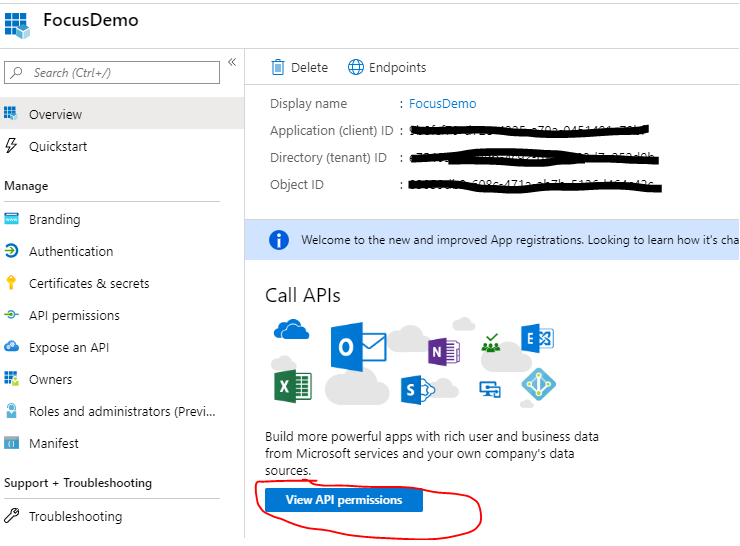


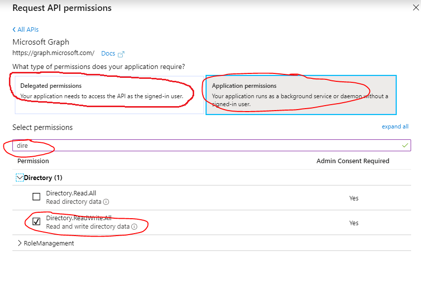

### 4. Grant the admin consent  


### 5. Generate the app secret, record the generated secret somewhere, we will need to configure it in code.


 ## Configure the app config file for the code
Assumptions for this section: 
-	You want to run the code as is
-	You have configured the Teams structure in SharePoint
-	You have registered the application in Azure Active Directory
Below is the detail for how to set the values: 
```
<add key="AppTenantId" value=""/>
```
The value should be the tenant id for the registered application.
```
<add key="AppClientId" value=""/>
```
The value should be the client id for the registered application.

 ```
<add key="AppClientSecret" value=""/>
```
The value should be the client secret generated inside the registered application.
```
<add key="AdminUserId" value=""/>
```
The value should be the admin user id, it's similar as [find the group id in Azure Active Directory](#how-to-find-the-group-id-for-a-o365-group), just search inside "Users" instead of "Groups".
```
<add key="AdminUserName" value=""/>
```
The value should be the admin user name, like admin@xxx.com.
```
<add key="AdminPassword" value=""/>
```
The value should be the admin user password.
```
<add key="SharePointGroupId" value=""/>
```
The value should be the group id where we host the Teams structure content, you can find the group name inside SharePoint and then [find the group id in Azure Active Directory](#how-to-find-the-group-id-for-a-o365-group) using the group name.
```
<add key="ChannelListNameInSP" value=""/>
```
The value should be the List name we configured in [this section](#create-channels-data).
For how to find the List name for a giving List, refer to [this section](#how-to-find-the-sharepoint-list-name).
```
<add key="ChannelNameFieldInSp" value=""/>
```
The value should the column name to host Channel names we configured in [this section](#create-channels-data).
```
<add key="ChannelAppListNameInSP" value=""/>
```
The value should be the list name we configured in [this section](#create-channels-tab-data).
For how to find the List name for a giving List, refer to [this section](#how-to-find-the-sharepoint-list-name).

```
<add key="ChannelApp_ChannelNameLookupFieldInSP" value=""/>
```
This value should be the column name for the Channel name look up field we configured in [this section](#create-channels-tab-data).
```
<add key="ChannelApp_TabNameFieldInSP" value=""/>
<add key="ChannelApp_AppIdFieldInSP" value=""/>
<add key="ChannelApp_AppEntityIdFieldInSP" value=""/>
<add key="ChannelApp_WebUrlFieldInSP" value=""/>
<add key="ChannelApp_ContentUrlFieldInSP" value=""/>
<add key="ChannelApp_RemoveUrlFieldInSP" value=""/>
```
Those values should be the column names to host the Channel tab information we configured in [this section](#create-channels-tab-data).   
For how to find the column name in SharePoint, refer to [this section](#how-to-find-the-sharepoint-list-column-name).

```
<add key="ChannelDocListNameInSP" value=""/>
```
This value should be the document library name we configured in [this section](#create-the-channels-documents-data). 
For how to find the name for a giving document library, refer to [this section](#how-to-find-the-sharepoint-list-name).

```
<add key="ChannelDoc_ChannelNameLookupFieldInSP" value=""/>
```
This value should be the column name for the Channel name look up field we configured in [this section](#create-the-channels-documents-data). 
For how to find the column name in SharePoint, refer to [this section](#how-to-find-the-sharepoint-list-column-name).

## References

### How to add the Lookup column in SharePoint
To get to lookup, select: Add column > More… 

 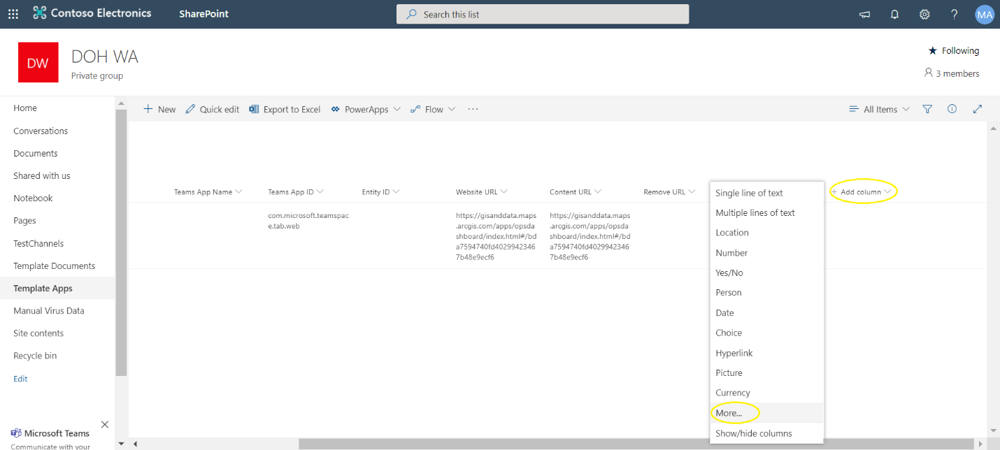

> Lookup (information already on this site)

 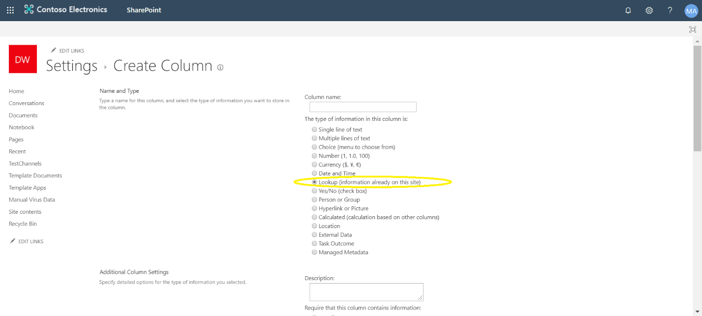

> Get Information from… “#Channels List Name#” > In this column… #The field of channel name# > OK

  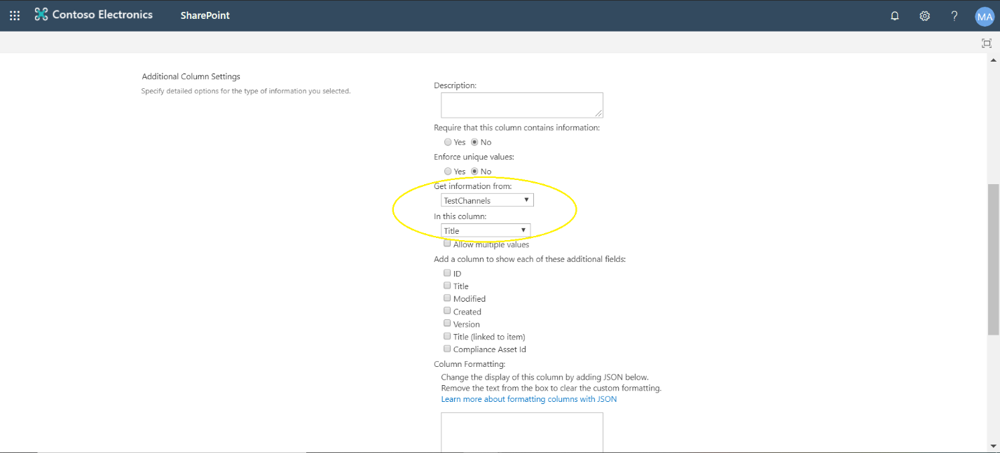

### How to find the SharePoint List column name
From the List menu, select “settings” and then click on the column you want. Grab the column name, then the name for the column will show up as the last part of the url after “Field=”.
 
 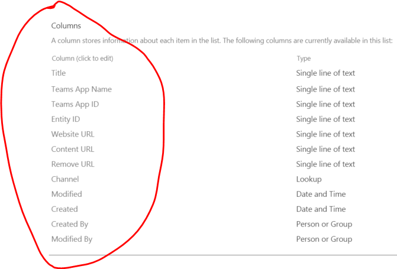
 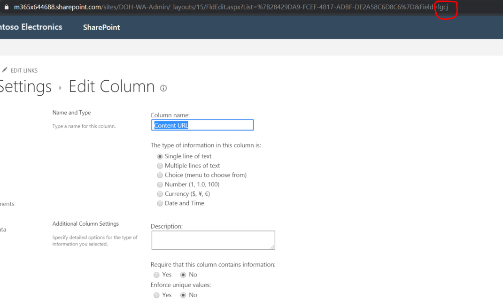
 
### How to find the Group id for a O365 group
1. Login into the [Azure portal](https://ms.portal.azure.com/) with admin account  
2. Find the group with display name, and record the object id

 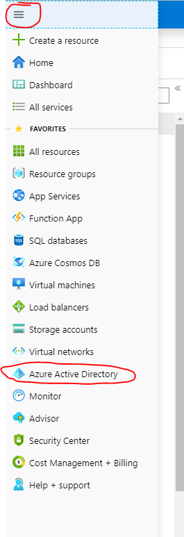

 

 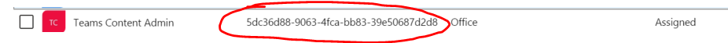

### How to find the SharePoint List name
Usually the name for SharePoint List or Document Library is just the display name, however, they may change if you have ever renamed them. Below is the way to find out the real name:
1.	Go the List (Document Library) setting

 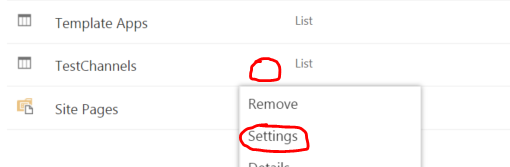
 

2.	Find the real name inside “Web Address”, it’s the url part before “AllItems.aspx”, in blew example, the name is “Channels”.

 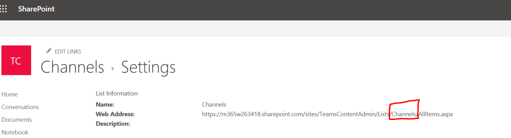
 

